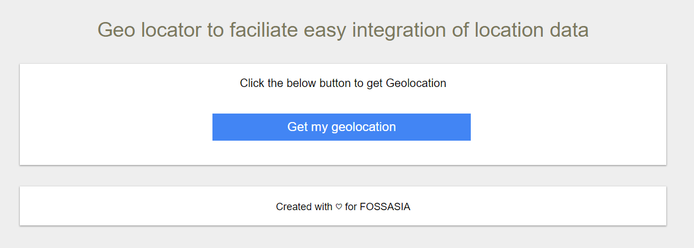

# Geolocation finder
This website is the official website of Fossasia when it comes to geolocations. It finds geolocation for integration in multiple projects 
the community looks after. This is basically a mini-project of [FOSSASIA](https://fossasia.org/).

## Repositories currently using geolocation
- [gci17.fossasia.org](https://github.com/fossasia/gci17.fossasia.org)
- [gci18.fossasia.org](https://github.com/fossasia/gci18.fossasia.org)

## How to use geolocation for other projects
The website currently supports only the [gci18.fossasia.org](https://github.com/fossasia/gci18.fossasia.org) repository where you can add the geo coordinates for mentors and students, the members of FOSSASIA are free to supply any further integrations, check the code in the <code>index.html</code> and do the needy.

### How to get geolocation
- visit [geolocation website](https://fossasia.github.io/geolocation/)
- click "Get my geolocation" button
- copy the coordinates and paste where wanted (you can add them directly to Mentors file \[If you are a mentor] in supported repository by visiting link in the bottom

## Branches:
We follow a simple branch framework, currently the gh-pages branch that should'nt amaze you right?

## Release History
* 1.0
    * CHANGE: Project born
